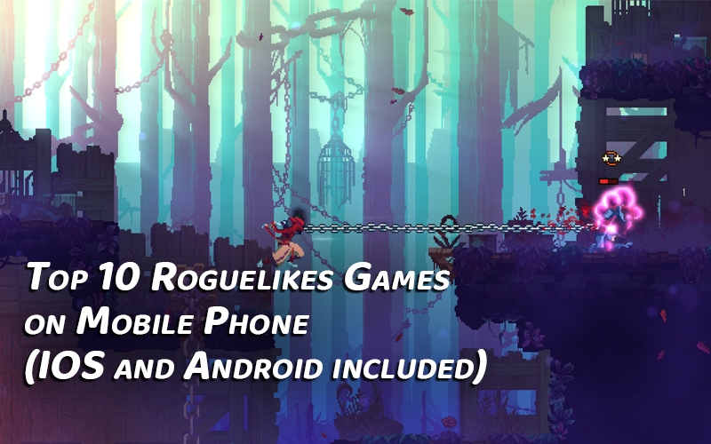
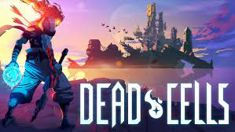
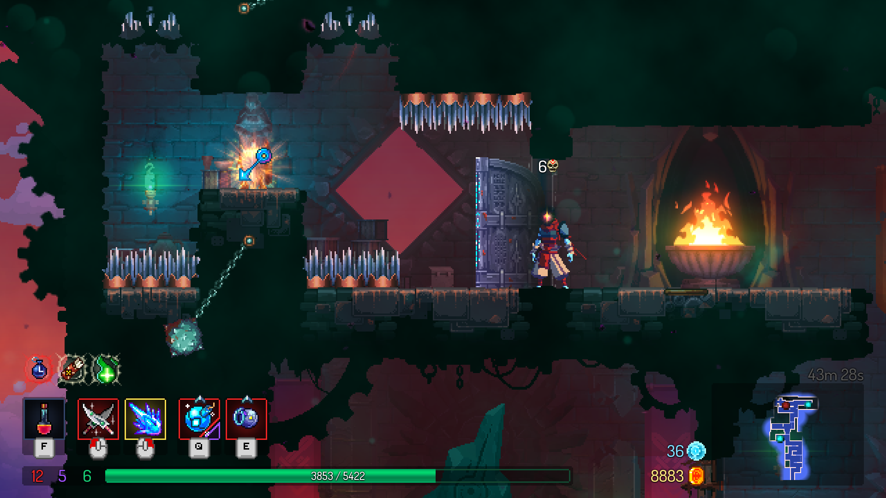
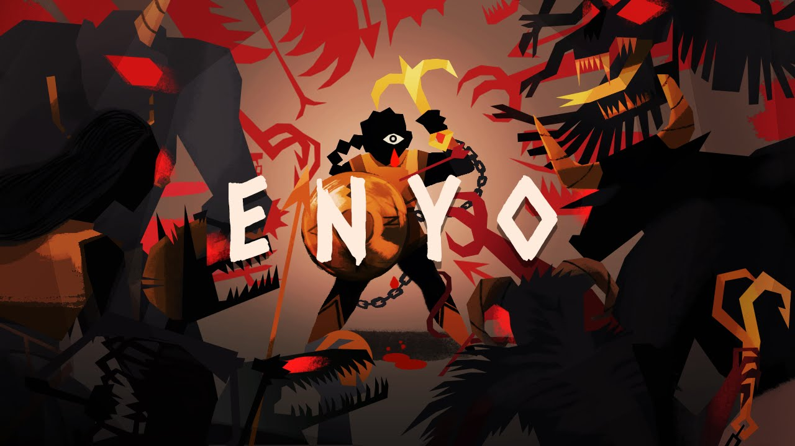
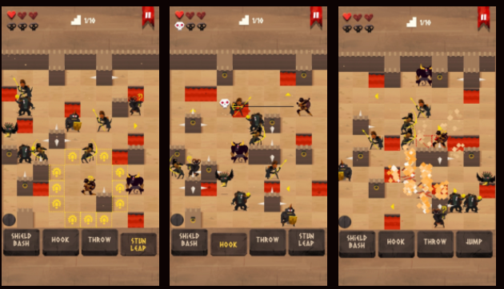

# Top 10 Roguelikes Games on Mobile Phone (IOS and Android included)



```
You may be replayed some roguelikes games from time to time, but well, in spite of that, your efforts helps roguelikes have risen to big popularity over those years. Mobile roguelike games include turn-based gameplay, discoloration and epic combat, and a rush progression circle, making you dive into its potential and replay again and again, ignore all the punishment each time you died
```

So now, let's rock into our top 10 Roguelikes Games on Mobile Phone.
<br>
<br>
<br>


## Dead Cells



A monument in the hack and slash dark dungeon roguelike, Dead Cells made a huge splash when it launched on PC back in 2017. 

Think of a game. Now disregard its narrative, level design, puzzles, and visual design. Would the simple act of moving around and interacting with that game’s world still be fun? The answer is yes for Dead Cells, that’s a perfect ‘game feel’ in action. It’s a rare quality, but Dead Cells made it.

You switch after every death between the three colored builds. Make sure you spend the money to upgrade your current equipment when available. Most importantly you need to keep rerolling your stats and mutations to synergize. As in increasing damage on bleeding enemies or critical hit damage on frozen enemies. Your arsenal, no matter the build, needs to match affixes as much as possible. 

You can try it here:

<a href="https://play.google.com/store/apps/details?id=com.playdigious.deadcells.mobile&hl=vi&gl=US" rel="">

</a> 
<a href="https://apps.apple.com/us/app/dead-cells/id1389752090" rel="">

</a>



<br>
<br>
<br>

## ENYO



ENYO is a game from `Arnold Rauers`, a big name in mobile game industry for Turn-Based Strategy Games.

Grab your hook & shield and descent as Enyo, the greek goddess of war, into an ever changing labyrinth to recover 3 legendary artifacts.

ENYO's gameplay is based on the idea of indirect combat. Enemies can only be defeated by pushing or pulling them into burning lava pits or deadly spiked walls.

ENYO's original prototype was made for the 7 day roguelike challenge 2016 as Hook & Shield. The game evolves around the idea of indirect combat. Enemies can't be attack directly and can only be defeated by pushing or pulling them into lava or spiked walls. This way the player is forced to use clever tactical positioning to remove enemies and descent through the 10 levels.
ENYO is based on greek mythology where the figure Enyo, the greek goddess of war, descents into an ever changing labyrinth to recover 3 legendary artifacts.

You can try it here

<a href="https://play.google.com/store/apps/details?id=com.tinytouchtales.enyo&hl=vi&gl=US" rel="">

</a> 
<a href="https://apps.apple.com/us/app/enyo/id1118353232" rel="">

</a>




